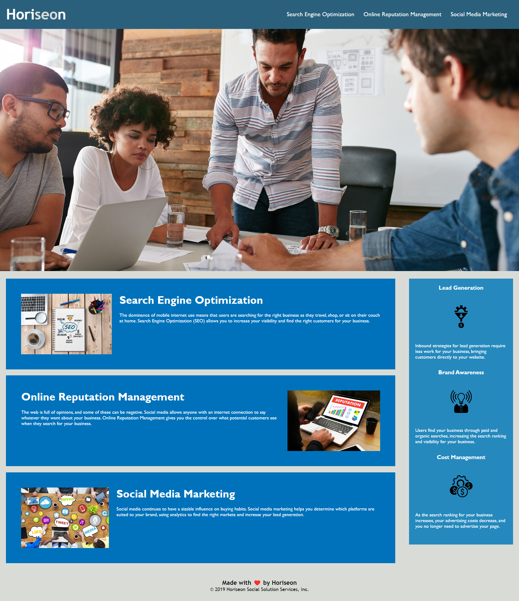

# Marketing-Agency-Accessibility-Improvements

## Description

A marketing agency has given us their website code and CSS and appointed us to improve it without changing any functionality. They wish to make their website more accessible to those with diabilities and more optimised for search engine indexing. Requirements to sucessfully complete this task are as follows:

* Semantic HTML elements must be found throughout the source code
* HTML elements must follow a logical structure independent of styling and positioning
* Image and icon elements are to contain accessible `alt` attributes
* Heading attributes will fall in sequential order
* Title elements will contain a concise, descriptive title
* Application links all function correctly.
* Application CSS selectors and properties are consolidated and organized to follow semantic structure.
* Application CSS file is properly commented.

## Installation

N/A

## Usage

The website repository can be found here: https://github.com/R0bsaunders/Marketing-Agency-Accessibility-Improvements

The website itself can be found here: https://r0bsaunders.github.io/Marketing-Agency-Accessibility-Improvements/

The website will look like the below screenshot:

The website will load corerctly and match the screenshot provided by the agency which can be found: 

## Credits

© 2022 edX Boot Camps LLC. Confidential and Proprietary. All Rights Reserved.

## License

There is no license